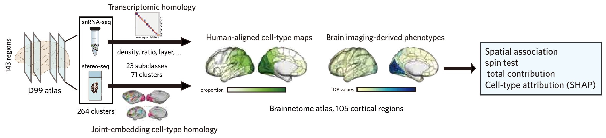

# HomoloMap

HomoloMap is a Python package for relating regional human brain imaging-derived phenotypes (IDPs) to cell-type-resolved cortical maps. Users provide a region-by-IDP table; HomoloMap supplies released cell-type maps, atlas transformations, spatial null models, multivariable analyses, and visualization tools.

The maps integrate whole-cortex macaque spatial transcriptomics from [Chen *et al.* (2023)](https://doi.org/10.1016/j.cell.2023.06.009) with the adult human single-nucleus taxonomy from [Siletti *et al.* (2023)](https://doi.org/10.1126/science.add7046). Cell-type correspondence is represented at subclass and cluster resolution, while cortical correspondence follows the joint-embedding alignment of [Xu *et al.* (2020)](https://doi.org/10.1016/j.neuroimage.2020.117346). Source maps in the [D99 atlas](https://afni.nimh.nih.gov/pub/dist/doc/htmldoc/nonhuman/macaque_tempatl/atlas_d99v2.html) are released in the [Human Brainnetome Atlas](https://doi.org/10.1093/cercor/bhw157) space for direct integration with regional IDPs.

[](docs/figures/HomoloMap_overview.pdf)

*Workflow overview. Transcriptomic and cortical correspondences project spatial cell-type measurements into Brainnetome regions, where they can be analysed with user-supplied brain IDPs. Click the figure for the vector PDF.*

## Main capabilities

- Load released human-aligned maps at subclass or cluster resolution with coverage audits.
- Transform cortical data between supported atlas spaces.
- Work with ratio, density, CLR, and ILR feature representations.
- Generate spatial null models and run spin-based association tests.
- Fit linear, random-forest, and support-vector models.
- Summarize total model performance, dominance contribution, and SHAP attribution.
- Analyze whole-cortex or laminar cell composition against user-supplied IDPs.
- Produce cortical surface plots, heatmaps, and contribution summaries.

## Included cell-type maps

The repository includes the spatial maps used to demonstrate HomoloMap:

| File | Atlas | Shape | Meaning |
|---|---|---:|---|
| `data/maps/D99/ctype_ratio_plot_D99.csv` | D99 | 132 × 226 | Original fine cell-type ratio map |
| `data/maps/D99/ctype_density_plot_D99.csv` | D99 | 141 × 257 | Original fine cell-type density map |
| `data/maps/BN/ctype_ratio_BN_23_subclass.csv` | Brainnetome | 105 × 23 | HomoloMap mapped and reclosed subclass composition |
| `data/maps/BN/ctype_ratio_BN_71_cluster.csv` | Brainnetome | 105 × 71 | HomoloMap mapped and reclosed cluster composition |

The Brainnetome files use the 105 cortical labels from one hemisphere (`1, 3, ..., 209`). They were generated from the D99 ratio map using the exact `plot` key in `data/mappings/cluster_mapping_dict.csv`. Of 226 source features, 191 were mapped; 35 unresolved features accounted for approximately 11.29% of the original ratio mass and were removed before reclosure. D99 labels 106, 118, and 194 had no target contribution during regional relabeling. See [`data/README.md`](data/README.md) and the audit JSON files for full provenance and interpretation.

## Installation

```bash
git clone https://github.com/Dthbca/HomoloMap.git
cd HomoloMap
python -m pip install -e .
```

Optional functionality can be installed with:

```bash
python -m pip install -e ".[all]"
```

Python 3.9 or newer is required.

## Third-party atlas resources

HomoloMap's D99/BN cell-type maps and homology table are installed with the
package. Larger third-party atlas resources are fetched only when requested and
are stored outside the source tree. By default HomoloMap uses the operating
system's user cache; set `HOMOLOMAP_DATA` or pass `data_dir=` to use a project
data directory.

```python
from HomoloMap.datasets import fetch_fslr, fetch_resource

# neuromaps manages the official fsLR download and cache
sphere = fetch_fslr(surf="sphere", hemi="L", return_path=True)

# Other provider files require an explicit URL and published checksum
atlas_file = fetch_resource(
    "provider-atlas-v1",
    url="https://provider.example.org/atlas-v1.nii.gz",
    sha256="<provider-or-release-SHA256>",
    data_dir="./data",       # optional
    download=True,
)
```

Downloads are written atomically and accepted only when their SHA256 matches.
Use `download=False` for a strictly offline run. HomoloMap does not silently
mirror or redistribute third-party atlas files; users should cite and follow
the terms of the original provider. fsLR retrieval follows the
[`neuromaps.datasets.fetch_fslr`](https://netneurolab.github.io/neuromaps/generated/neuromaps.datasets.fetch_fslr.html)
interface. Brainnetome and D99 resources should be obtained from their
[official Brainnetome resource page](https://www.brainnetome.org/resource/) and
[official AFNI D99 distribution](https://afni.nimh.nih.gov/pub/dist/doc/htmldoc/nonhuman/macaque_tempatl/atlas_d99v2.html),
respectively.

See [`THIRD_PARTY_RESOURCES.md`](THIRD_PARTY_RESOURCES.md) for the boundary
between HomoloMap-derived data, optional cached atlas resources, and
user-supplied imaging phenotypes, together with provider and licensing notes.

## Tutorial

The documentation is split into short, task-oriented notebooks:

1. [`Prepare brain IDPs`](tutorials/01_prepare_brain_idps.ipynb): input format, BN label alignment, quality control, and saved analysis tables.
2. [`Spatial spin tests`](tutorials/02_spin_test.ipynb): individual cell-type associations and FDR correction.
3. [`Total contribution and SHAP`](tutorials/03_total_contribution_and_shap.ipynb): joint model performance and optional feature attribution.
4. [`CLR sensitivity`](tutorials/04_clr_sensitivity.ipynb): comparison of mapped ratios with a centered log-ratio representation.

See the [`tutorial index`](tutorials/README.md) for prerequisites, expected outputs, recommended execution order, and the visual summary produced by each notebook. Each notebook is focused on one analytical question and can be opened independently. Deterministic toy IDPs are provided only to check execution; replace them with your own BN-indexed brain maps for scientific analysis.

## What you provide

The external input is one or more brain imaging-derived phenotypes (IDPs).
`HomoloMap.transforms.load_data` accepts:

- a `pandas.Series` or `pandas.DataFrame` already indexed by numeric atlas labels;
- a CSV file with region labels in its first column;
- a scalar GIFTI surface file or loaded `nibabel.GiftiImage`;
- a NIfTI volume file or loaded `nibabel.Nifti1Image` (install `.[volume]`);
- any corresponding `str` or `pathlib.Path` file path.

The loader returns a common ROI-by-IDP `DataFrame`: rows are atlas regions and
columns are cortical thickness effects, functional measures, MEG frequency
maps, disease effect maps, or other regional phenotypes. For image inputs,
specify the source space and parcellation; `trg="BN"` produces the regional
format used by the released HomoloMap predictors.

```python
from HomoloMap.transforms import load_data

# Already parcellated DataFrame, Series, or CSV
brain_idps = load_data(idp_input, atlas="BN", trg="BN", smooth=False)

# Scalar surface/volume image; provide the matching source atlas resource
brain_idps = load_data(
    image_input, space="fslr", atlas="BN",
    path="/path/to/BN.label.gii", trg="BN", smooth=False,
)
```

Labels—not row position—define alignment. Missing values are allowed only
where the selected downstream analysis supports them.

Cell-type ratios or densities are **not** the usual external input to the analysis workflow. They are predictors supplied by HomoloMap. You may nevertheless load the released cell-type tables directly for a custom analysis.

### Optional laminar workflow

Laminar analyses additionally require the source dataset containing
`Spatial/raw_counts_d99.npy`; these third-party raw measurements are not
redistributed in the wheel. The primary feature definition normalizes in D99,
relabels each layer, and then re-closes the composition in the target atlas:

```python
from HomoloMap.datasets import fetch_layer_ratio

layer_ratio, audit = fetch_layer_ratio(
    data_dir="/path/to/BigBrainLayer/dataset",
    target_atlas="BN",
    level="subclass",
    normalization="within_region_cross_layer",
    normalization_order="before_relabel",
    reclose=True,
    mask="external",
    return_mapping=True,
)
```

Use `normalization="within_layer"` when the question concerns cell-type
composition inside each layer. The returned audit records mapping coverage,
spatially dropped labels, the denominator, masking, and post-relabel closure.

## Repository layout

- `src/HomoloMap/datasets`: dataset loaders and mapping utilities.
- `src/HomoloMap/transforms`: atlas, geometry, smoothing, and composition transforms.
- `src/HomoloMap/stats`: spatial nulls, model analysis, and laminar statistics.
- `src/HomoloMap/plotting.py`: surface and statistical visualization.
- `tutorials`: ordered, task-oriented notebooks for the complete IDP workflow.
- `examples`: one minimal compositional-transform example; the complete workflow lives in `tutorials`.
- `tests`: lightweight package tests.
- `data`: original D99 maps, HomoloMap-derived BN maps, mapping table, and provenance audits.
- `src/HomoloMap/datasets`: dataset loaders plus the canonical D99/BN cell-type resources used by the public workflow.

The repository includes released D99 and BN cell-type maps. Project-specific brain IDPs are not included and are expected to be supplied by the user.

## Statistical interpretation

Spatial autocorrelation can inflate ordinary parametric significance. HomoloMap therefore supports spatially constrained null models. Multiple-comparison families, atlas coverage, preprocessing choices, and held-out prediction design remain the responsibility of the analyst. Correlation, dominance, and SHAP results describe spatial association or model dependence, not causality.

## Citation

If you use HomoloMap, cite the repository and the specific release or commit. A formal software citation is provided in [`CITATION.cff`](CITATION.cff).

## License

HomoloMap is released under the [MIT License](LICENSE).
